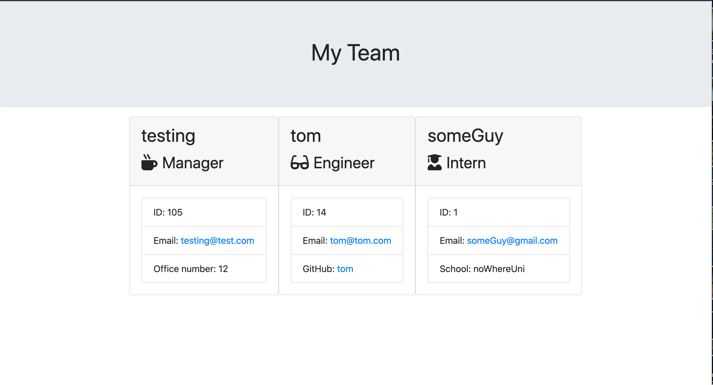

  # Team Generator
  
  ## Table of Contents
  - Description
  - Installation
  - Usage
  - License
  - Contributions
  - Tests
  - Questions
  
  ## Description
  Allows user to generate a team based on given questions which will generate a card for the user
  
  ## Installation
  npm i

  ## Usage
  people who need to create information cards of their employees

  ## Contributions
  

  ## Tests
  inquirer

  ## Questions
  no

  ### Github
    

  [jngo2013](https://github.com/jngo2013)

  ### License
  This project is licensed under the MIT License - see the [LICENSE.md](https://choosealicense.com/licenses/mit/#) 
  
  

  